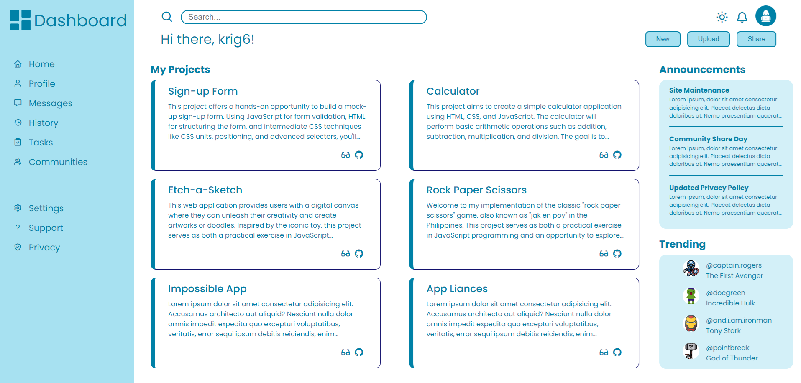
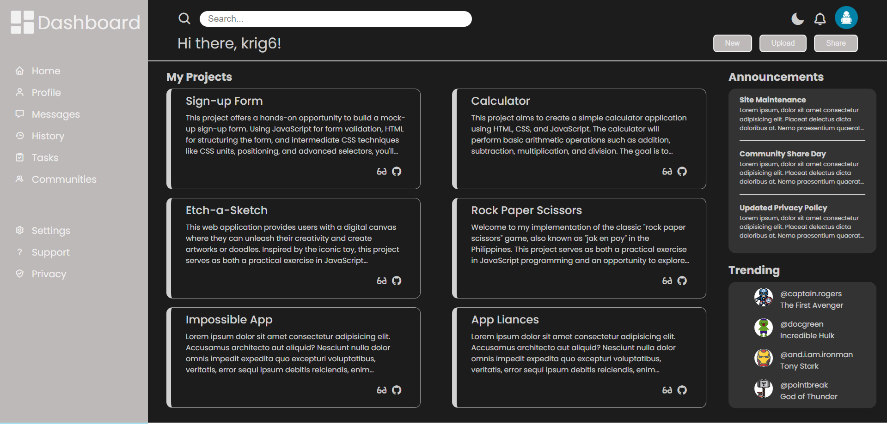

# Project: Admin Dashboard

## Overview

For this project, the goal is to develop an admin dashboard mockup. It will feature toggling of light and dark mode using JavaScript, structured with HTML, and styled with CSS. The focus will be on creating a visually appealing interface with light and dark mode themes. Although the dashboard won't have functional components, it will showcase animations to enrich user experience, providing insights into potential functionalities.

Dash [here](https://krig6.github.io/odin-dashboard/)!

## Sample

## Technologies Used

- HTML: Provides the structure and layout of the dashboard.
- CSS: Styles the overall interface with animations.
- JavaScript: Implements toggling of light and dark modes for the dashboard.

## Features

- Basic Animations: Hover animations to enhance user interaction and visual appeal.
- Light and Dark Mode Toggle: Users can simply click or tap on the toggle button to switch between light and dark mode, offering a seamless transition between the two themes.
- Repository Icon: Clicking on the repository icon redirects you to the project's repository on the respective hosting platform, GitHub. This allows developers and contributors to review the source code, suggest improvements, report issues, or fork the project for their own use.
- Live Demo Icon: The live demo icon allows you to experience the projects showcased within the admin dashboard firsthand. By clicking on this icon, you'll be able to interact with each project, exploring its features and functionality in a live environment.

## Learning Path

This project is part of my journey through The Odin Project's course. The primary objective here was to leverage CSS Grid for laying out the majority of the dashboard. While the focus was on mastering Grid, I also aimed to infuse some personal creativity into the design. Choosing the set of color palette and incorporating animations, enhancing the overall user experience. Structuring the HTML layout proved to be challenging too, as precision is crucial for Grid to function as intended. However, through perseverance and experimentation, I believe I've crafted a visually appealing dashboard.

Your feedback is highly appreciated! Feel free to explore my previous repositories for more projects.

## Future Enhancements

- A complete and functional dashboard
- Data visualizations using charts, graphs or tables
- Task management and User management
- Reporting
- Alerts and notifications
- Dynamic animations for better user experience
- Responsive design for all devices
